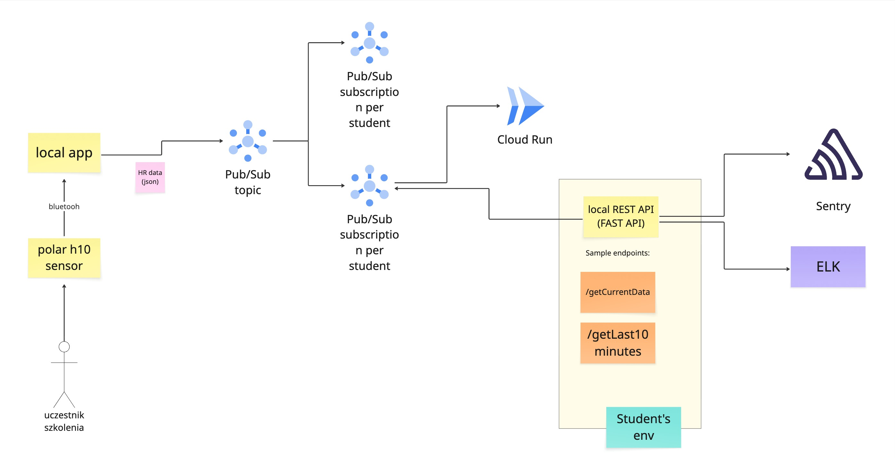

# szkolenie-15_01_2025

Repo na szkolenie 15-16.01.2025

## Polar h10 app
Below you can see a diagram of the Polar h10 app.

Short description of the app:
- Polar h10 app is a real-time heart rate monitoring app.
- It uses the Polar h10 sensor to read heart rate data.
- `polarh10-producer` is a Python application for reading heart rate data from Polar H10 sensors via Bluetooth Low Energy (BLE). The app supports both normal mode (with actual sensor) and test mode (with simulated random data). It can send data to Google Cloud Pub/Sub for cloud integration or print to screen for local monitoring.
> Do not run this app on your local machine during training. We will run just one instance of this app.
- The heart rate data is sent to the cloud via Pub/Sub.
- Each student have own Pub/Sub subscription to read data from.
- `polarh10-backend` is a Django backend for receiving heart rate data from Google Cloud Pub/Sub and exposing it via REST API.
- the app can be run locally directly or via Docker.
- `polarh10-frontend` is a Next.js frontend for displaying the heart rate data.
- In order to you will need this data:
    - PubSub project id
    - PubSub subscription name
    - PubSub credentials file